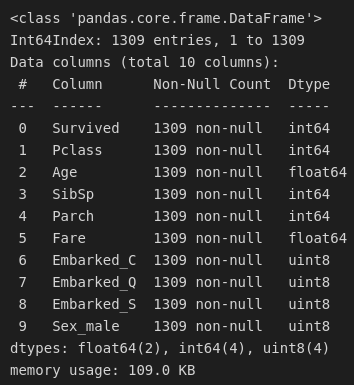

# Trabalho Final -Aprendizado de Máquina

> Fundação Getúlio Vargas RJ - Escola de Matemática Aplicada<br>
> Graduação em Ciência de Dados e Inteligência Artificial<br>
> Disciplina: Aprendizado de Máquina<br>
> Aluno: Gianlucca Devigili<br>

## Objetivo Geral:
Treinar modelos de *machine learning* utilizando o clássico *dataset* do Titanic de modo a prever os sobreviventes do desastre bem como descobrir quais fatores mais influenciaram na sobrevivência dos passageiros.

# 1. Os dados
Para a execução do presente trabalho, utilizei o clássico dataset do [titanic](https://www.kaggle.com/competitions/titanic/data).  Uma pequena amostra dos dados pode ser vista na imagem abaixo:


O dataset contém dados referentes à $494$ sobreviventes e $815$ pessoas que não sobreviveram.

## 1.1. Dicionário de Dados
O dataset conta com:
+ 5 colunas categóricas (tipo: `object`)
+ 4 colunas discretas (tipo: `int 64`)
+ 2 colunas contínuas (tipo: `float 64`)

As colunas do dataset são as seguintes:
+ **Survived:** `bool` - `{0, 1}` - a coluna *target* do dataset. Indica se o passageiro sobreviveu ($1$) ou não ($0$);
+ **PClass:** `int` - `{1, 2, 3}` - indica a classe do passageiro, sendo primeira classe a mais alta e a terceira a mais baixa;
+ **Name:** `str` - nome do passageiro. A coluna não foi utilizada para a realização do trabalho por conta da grande complexidade de tratar tal coluna de forma efetiva. Uma maneira da qual estes dados poderiam ser utilizados é a identificação por sobrenome e uma classificação em famílias, contudo pessoas com sobrenomes iguais porém de famílias diferentes poderiam ser impossíveis de distinguir dado as informações presentes no dataset, além da geração de uma grande quantidade de *features* novas que não garantiriam melhora na performance do modelo, além de acarretar em aumento da complexidade do mesmo.
+ **Sex:** `str` - `{"male", "female"}` - indica o sexo do passageiro (feminino ou masculino);
+ **SibSp:** `ìnt` - `0 à 8` - indica a quantidade de irmãos e cônjuges a bordo do navio;
+ **Parch:** `int` - `0 à 9` - indica o número de pais e filhos a bordo do navio;
+ **Ticket:** `tr` - indica o número do bilhete de embarque. A coluna não foi utilizada  por conta da grande diversidade de formas de identificação do número dos bilhetes, o que poderia gerar dificuldades de tratar corretamente os dados;
+ **Fare:** `float` - indica o preço pago na passagem;
+ **Cabin:** `str` - indica a cabine do passageiro. Por conta da grande quantidade de dados faltantes, a coluna não foi utilizada no dataset.
+ **Embarked:** `str` - `{C = Cherbourg, Q = Queenstown, S = Southampton}` - indica o porto de embarque do passageiro. O dataset, obviamente, apenas considera passageiros que realmente embarcaram.

## 1.2. Tratamento dos Dados
O dataset original, como tem o propósito de servir como dataset para uma competição do *website Kaggle*, está subdividido em 3 datasets: `train.csv`, `test.csv` e `gender_submission_csv`, sendo este último contendo a coluna `Survived` referente aos dados do dataset de teste. Preferi juntar todos os dados em um único dataset e então dividir novamente em treino e teste por dois motivos principais: precisei realizar algumas transformações e tratamentos nos dados de algumas colunas e a concatenação dos datasets em um só tornou tal processo mais efetivo e a possibilidade de uma análise exploratória completa com os dados dos passageiros do navio.

Primeiramente eliminei as colunas `Name` e `Ticket` pelos motivos já discutidos acima, bem como a coluna `Cabin` pela grande quantidade de dados faltantes na mesma.

Agora, analisando as informações do dataset mostradas pelo método  `pandas.DataFrame.info()`, temos:


evidenciando a necessidade de tratamento de dados faltantes nas colunas `Age`, `Fare` e `Embarked`.

Para a coluna `Age`, substituí os dados faltantes pela idade média dos passageiros: 30 anos.

Para a coluna `Fare`, substituí os dados faltantes pela moda da coluna, no caso o porto de Southampton (`"S"`), que onde provavelmente foi o embarque de fato de tais passageiros já que existem $914$ embarques neste porto, contra $270$ em Cherbourg e $123$ em Queenstown.

Para a coluna `Fare`, de modo a deixar ela mais próxima do que poderia ser o dado real que não está presente na base, utilizei o fato de que a classe do passageiro tem grande influência no valor de sua passagem, o que pode ser evidenciado na seguinte visualização:


portanto substituí os dados faltantes pelo preço médio da passagem referente à classe do passageiro que não tinha este dado.

Um problema encontrado na coluna `Fare` que pode ser visto no *boxplot* acima é a presença de valores estremos no dataset. Ao todo são 4 valores com tal problema e todos eles apresentam o valor de $\$512.3292$, indicando que provavelmente se trata de um *outlier*. Da mesma forma que fiz com o passageiro que não possuía um valor de passagem, substituí os dados extremos pela média do valor da passagem agrupada pela classe dos passageiros, que neste caso em particular era a primeira classe.

### Tratando os Dados Categóricos
A primeira modificação para tratar os dados categóricos foi a transformação da coluna `Embarked` em *dummies*, ou seja, em 3 colunas booleanas que indicam se o passageiro embarcou (1) ou não (0) naquele determinado porto.
Em sequência, transformei a coluna `Sex` em uma coluna booleana, indicando se o passageiro é do sexo masculino (1) ou feminino (0).
Tal tratamento de dados foi realizado através da função `pandas.get_dummies()`, no segundo caso usando o parâmetro `drop_first=True` para termos apenas uma coluna chamada `Sex_male` ao invés dela e a coluna `Sex_female` que é apenas a contraparte da primeira coluna booleana.

### Dataset Final
Como dataset final temos o dataset `df_dummies` com os seguintes metadados:


e como amostra dos dados temos a tabela:


que contém os dados referentes aos mesmos passageiros da amostra da primeira imagem deste documento.

## 1.3. Análise Exploratória
Seguem as estatísticas de cada uma das colunas numéricas do dataframe:


Podemos observar que a coluna referente à quantidade de irmãos e cônjuges (`SibSp`) possui uma grande quantidade de zeros, tanto que a média fica abaixo de 1 e apenas o terceiro quartil apresenta o valor 1. Outro detalhe interessante é a quantidade de pais/filhos (`Parch`) que desta vez apresenta valores iguais a zero em todos os quartis, evidenciando que os passageiros do Titanic, em sua maioria, estavam sozinhos ou apenas na presença do cônjuge, bem como a presença de uma grande família à bordo.

Outro ponto importante observável nessas estatísticas diz respeito à coluna `Fare` a média e a mediana divergem bastante, sendo que a média está mais perto do $3^o$ quartil do que da mediana, porém apresentando um baixo desvio padrão. Tal estatísticas ficam mais fáceis de se entender visualizando-se a frequência de cada variável utilizando um histograma (`bins = 50`):

### Histograma de `Fare` (Preço da Passagem)


A maior concentração dos preços das passagens está em valores baixos, contudo existem diversos passageiros com passagens de valores altos que chegam a ser discrepantes do restante. Inclusive, este gráfico desconsidera aqueles valores extremos iniciais que estavam acima de 500 dólares.

Outra maneira de se visualizar tais dados é através de um boxplot, agora separado pela classe do passageiro:


Note uma média maior agora e que os dados se encontram melhor distribuídos dentro dos respectivos desvios padrões. Uma curiosidade é que existem vários valores baixos na primeira classe por conta de funcionários que não pagaram pela passagem porém ficaram em cabines privilegiadas. O boxplot acima difere do apresentado na sessão 1.2. por não conter os *outliers*.

#### Frequência de Idade
Aqui podemos observar uma maior frequência em adultos entre 20 e 40 anos, como descrito pelas estatísticas na tabela anterior. O presente gráfico não mostra os dados tratados com os valores faltantes para uma melhor visualização, já que teríamos uma coluna enorme na média, além de a ideia aqui ser mostrar os dados reais.


### Correlações
Utilizando o método `pd.DataFrame.corr()`, calculei a correlação entre colunas do dataset:
```python
corr = df_dummies.corr()
corr.style.background_gradient(cmap='coolwarm_r')
```

De uma forma visualmente mais apresentável:
```python
ax = sns.heatmap( corr,
				vmin=-1, vmax=1, center=0,
				cmap='vlag_r', #sns.diverging_palette(20, 220, n=200),
				square=True
)

ax.set_xticklabels(
	ax.get_xticklabels(),
	rotation=65,
	horizontalalignment='right'
);
```


Podemos observar uma forte correlação entre `Fare` e `PClass`, que aqui é negativa pois quanto maior a classe, menor seu valor numérico (primeira classe = 1, e assim por diante). Outro fato interessante é a correlação da classe com o porto de embarque e também com o sexo. Além disso há uma correlação notável entre o preço da passagem e a idade e o preço da passagem a quantidade de parentes à bordo. Por fim, os gráficos mostram mais uma curiosidade, que passageiros mais velhos tenderam à viajar sozinho (correlação negativa entre `Age` e `SibSp` e  entre `Age` e `Parch`), o que pode ser explicado pelas crianças estarem acompanhadas pelos pais.

Contudo as correlações mais importantes são as entre a coluna `Survived`, nossa coluna *target*, e as demais:
```python
aux_corr = corr['Survived'].drop('Survived')#.sort_values(ascending=False)
aux_corr = aux_corr.sort_values(ascending=False)
print(aux_corr)

> output:
Fare        0.232247 
Embarked_C  0.121156 
Parch       0.108919 
Embarked_Q  0.040950 
SibSp       0.002370 
Age        -0.048806 
Embarked_S -0.133020 
Pclass     -0.264710 
Sex_male   -0.688371

```

Analisando graficamente:
```python
sns.barplot(
	x = aux_corr,
	y = aux_corr.index,
palette='vlag');

```


podemos observar então uma maior mortalidade entre homens e uma maior taxa de sobrevivência entre aqueles que pagaram mais por sua passagem. Além disso há uma correlação alta com o porto de embarque, que é explicada pela correlação destas colunas com a coluna `Fare`.

### Gráfico de Densidades das variáveis numéricas separadas pela coluna *Target*:
Por fim, observando a densidade, podemos observar novamente a confirmação das correlações, além de notar que uma pequena quantidade de irmãos possui influência na sobrevivência, enquanto muitos irmãos ou nenhum não faz diferença. Além disso a influência da idade na sobrevivência diminui após a mesma passar da média (30 anos).


# 2. Modelos
Na execução do trabalho, utilizei os seguintes modelos:
+ K-Nearest Neighbors (`sklearn.neighbors.KNeighborsClassifier`);
+ K-Nearest Neighbors (implementação própria);
+ Regressão Logística (`sklearn.linear_model.LogisticRegression`);
+ Support Vector Machine Classifier (`sklearn.svm.LinearSVC`)
+ Stochastic Gradient Descent (`sklearn.linear_model.SGDClassifier`)
+ Gaussian Process Classifier (`sklearn.gaussian_process.GaussianProcessClassifier`)
+ Decision Tree Classifier (`sklearn.tree.DecisionTreeClassifier`)
+ Random Forest Classifier (`sklearn.ensemble.RandomForestClassifier`)
+ Perceptron (`sklearn.linear_model.Perceptron`)

Para a escolha dos melhores hiperparâmetros utilizei Randomized Seach CV (`sklearn.model_selection.RandomizedSearchCV`). A preferência pelo mesmo ao invés do Grid Search CV foi por conta da velocidade de execução, já que ao testar alguns modelos com Grid Search o tempo de execução foi de horas. Portanto optei por testar uma maior diversidade de modelos em detrimento de talvez não ter a combinação mais otimizada de hiperparâmetros.

Os modelos foram treinados usando uma divisão de 70% do dataset para treino e 30% para teste, resultando em 916 linhas para treino e 393 linhas para teste.

## 2.1. K-Nearest Neighbors (Implementação Própria)
Por conta da simplicidade do algoritmo de KNN, decidi por implementar manualmente o algoritmo para testar o mesmo:
```python
class KnnClassifier:

	def __init__(self, k:int = 5) -> None:
		self.k = k
		self.distances = distances
	
	def fit(self, x_train: pd.DataFrame, y_train: pd.Series) -> None:
		self.x_train = x_train	
		self.y_train = y_train
	
	def predict(self, x_test: pd.DataFrame) -> pd.Series:
		y_pred = []
		
		for idx, x in x_test.iterrows():
			# calculate the distances
			distances = np.sqrt(np.sum((self.x_train - x)**2, axis = 1))
	
			# sort the distances
			knn_idx = distances.argsort()[:self.k]
	
			# get the labels of the K nearest neighbors
			knn_labels = self.y_train.iloc[knn_idx]
	
			# get the label for the datapoint
			y_pred.append(knn_labels.value_counts().idxmax())
	
		return pd.Series(y_pred, index = x_test.index)

  
# Testing for some values of K
for k in [1, 3, 5, 10, 15, 20, x_train.shape[0]]:
	knn = KnnClassifier(k)
	knn.fit(x_train, y_train)
	prediction = knn.predict(x_test)
	print(f'Implemented KNN with {k} neighbors: {accuracy_score(prediction, y_test)}')
```

Accuracies do modelo implementado:
```python
Implemented KNN with 1 neighbors: 0.6666666666666666
Implemented KNN with 3 neighbors: 0.6921119592875318 
Implemented KNN with 5 neighbors: 0.6921119592875318 
Implemented KNN with 10 neighbors: 0.6870229007633588 
Implemented KNN with 15 neighbors: 0.6717557251908397 
Implemented KNN with 20 neighbors: 0.6615776081424937 
Implemented KNN with 916 neighbors: 0.5648854961832062
```

Accuracies da implementação do sklearn:
```python
Sklearn KNN with 1 neighbors: 0.6513994910941476 
Sklearn KNN with 3 neighbors: 0.6895674300254453 
Sklearn KNN with 5 neighbors: 0.6921119592875318 
Sklearn KNN with 10 neighbors: 0.6615776081424937 
Sklearn KNN with 15 neighbors: 0.6717557251908397 
Sklearn KNN with 20 neighbors: 0.6564885496183206 
Sklearn KNN with 916 neighbors: 0.5648854961832062
```

O modelo que implementei apresentou uma acurácia levemente melhor para a maioria dos valores de $k$ testados, contudo a minha versão demorou em torno de 4.4 segundos para terminar a execução de todos os valores de $k$, em contrapartida ao modelo do *sklearn* que levou 0.3 segundos para a mesma aplicação.

## 2.2. K-Nearest Neighbors (sklearn)
Parâmetros testados:
```python
params = {
	'n_neighbors': [1, 3, 5, 6, 7, 8, 9, 10, 15, 20, x_train.shape[0]],
	'weights': ['uniform', 'distance'],
	'algorithm': ['auto', 'ball_tree', 'kd_tree', 'brute'],
	'p': [1, 2],
}
```
+ `weigths` diz respeito ao cálculo da "distância" entre vizinhos;
+ `algorithm` diz respeito ao algoritmo utilizado para o cálculo da "distância" entre vizinhos;
+ `p = 1` calcula a distância como *manhattan distance* e `p = 2` calcula a distância como distância euclidiana.

```python
choose_knn = model_selection.RandomizedSearchCV(KNeighborsClassifier(), params, cv=cv, scoring='accuracy', n_jobs=-1).fit(x_train, y_train)
  
print(f'best score: {choose_knn.best_score_}')
print(f'best params: {choose_knn.best_params_}')

> best score: 0.7270289855072464
> best params: {'weights': 'uniform', 'p': 1, 'n_neighbors': 10, 'algorithm': 'ball_tree'}
```

Treinando um modelo com os melhores parâmetros:
```python
best_knn = KNeighborsClassifier(
	n_neighbors=choose_knn.best_params_['n_neighbors'],
	weights=choose_knn.best_params_['weights'],
	algorithm=choose_knn.best_params_['algorithm'],
	p=choose_knn.best_params_['p']
).fit(x_train, y_train)

classifier_evaluation(best_knn, x_test, y_test)

> ROC Score: 0.65263948158685 
> Accuracy Score: 0.6819338422391857 
> Average Precision Score: 0.5610012945850632 
> f1 Score: 0.5387453874538746
```


## 2.3. Regressão Logística
Parâmetros Testados:
```python
params = {
	'penalty': ['l1', 'l2', 'elasticnet', 'none'],
	'tol': [1e-5, 1e-4, 1e-3, 1e-2, 1e-1, 1, 10, 100, 1000],
	'C': [0.001, 0.01, 0.1, 1, 10, 100, 1000, 10000, 100000],
	'solver': ['newton-cg', 'lbfgs', 'liblinear', 'sag', 'saga'],
}
```
+ `penalty` diz respeito à norma da penalidade, sendo L1, L2, ambas (`elasticnet`) ou nenhuma (`none`);
+ `tol` (tolerância) diz respeito ao critério de parada;
+ `C` diz respeito ao inverso da força de regularização. Como em SVM, valores menores especificam uma maior regularização;
+ `solver` diz respeito ao algoritmo utilizado no problema de otimização;

```python
choose_regression = model_selection.RandomizedSearchCV(LogisticRegression(), params, cv=cv, scoring='accuracy', n_jobs=-1).fit(x_train, y_train)

print(f'best score: {choose_regression.best_score_}')
print(f'best params: {choose_regression.best_params_}')

> best score: 0.846207729468599 
> best params: {'tol': 0.01, 'solver': 'lbfgs', 'penalty': 'none', 'multi_class': 'multinomial', 'C': 0.001}
```

Treinando com os melhores parâmetros:
```python
best_regression = LogisticRegression(
	penalty=choose_regression.best_estimator_.penalty,
	tol=choose_regression.best_estimator_.tol,
	C=choose_regression.best_estimator_.C,
	solver=choose_regression.best_estimator_.solver,
	multi_class=choose_regression.best_estimator_.multi_class,
	max_iter=10**6
).fit(x_train, y_train)

classifier_evaluation(best_regression, x_test, y_test)

> ROC Score: 0.8728465307412675 
> Accuracy Score: 0.8753180661577609 
> Average Precision Score: 0.7968777654358917 
> f1 Score: 0.8563049853372433
```


Curva ROC:


## 2.4. Support Vector Machine Classifier
Parâmetros testados:
```python
params = {
	'kernel': ['linear', 'poly', 'rbf', 'sigmoid'],
	'C': np.linspace(0.1,3,7),
	'degree': [2, 3, 4, 5],	
	'gamma': np.logspace(-5, 0, 7)
}
```
+ `kernel` diz respeito ao tipo do kernel a ser usado pelo algoritmo;
+ `C` diz respeito ao parâmetro de regularização com penalidade L2;
+ `degree` diz respeito ao grau da função polinomial do kernel;
+ `gamma` diz respeito ao coeficiente do kernel para os kernels rbf, polinomial (*poly*) e sigmóide.

Como o código utilizado para a escolha de parâmetros e avaliação se repete apenas mudando o modelo utilizado, irei apenas anexar os resultados a partir deste modelo.

Utilizando os melhores parâmetros:
```python
best_svc = SVC(
	kernel='linear',
	C=3.0,
	degree=5,
	gamma=0.021544346900318846,
	max_iter=-1
	shrinking=True,
	tol=0.001
	probability=False,
	cache_size=200,
	random_state=0
).fit(x_train, y_train)

classifier_evaluation(best_svc, x_test, y_test)

> ROC Score: 0.8728465307412675 
> Accuracy Score: 0.8753180661577609
> Average Precision Score: 0.7968777654358917 
> f1 Score: 0.8563049853372433
```


## 2.5. Stochastic Gradient Descent
Parâmetros Testados:
```python
params = {
	'loss': [
		'hinge',
		'log_loss',
		'log',
		'modified_huber',
		'squared_hinge',
		'perceptron',
		'squared_error',
		'huber',
		'epsilon_insensitive',
		'squared_epsilon_insensitive'
	],
	'penalty': ['l2', 'l1', 'elasticnet'],
	'alpha': np.logspace(-5, 0, 7),
	'shuffle': [True, False],
	'learning_rate': ['constant', 'optimal', 'invscaling', 'adaptive'],
}
```
+ `loss` diz respeito a função de perda a ser utilizada;
+ `alpha` constante que multiplica o termo da regularização;
+ `shuffle` booleano que indica se os dados devem ou não ser embaralhados após cada *epoch*;
+ `learning_rate` diz respeito à taxa de aprendizado do modelo.

```python
best accuracy: 0.7259384651936327 
best params: {'shuffle': True, 'penalty': 'l2', 'loss': 'log', 'learning_rate': 'optimal', 'alpha': 0.0004641588833612782}
```

Treinando com os melhores parâmetros:
```python
best_sgd = SGDClassifier(
	loss= choose_sgd.best_estimator_.loss,
	penalty=choose_sgd.best_estimator_.penalty,
	alpha=choose_sgd.best_estimator_.alpha,
	shuffle=choose_sgd.best_estimator_.shuffle,
	learning_rate=choose_sgd.best_estimator_.learning_rate,
	max_iter=10**6,
	tol=0.001,
).fit(x_train, y_train)

classifier_evaluation(best_sgd, x_test, y_test)

> ROC Score: 0.5029239766081871 
> Accuracy Score: 0.5674300254452926 
> Average Precision Score: 0.4384179277710817 
> f1 Score: 0.011627906976744186
```


## 2.6. Gaussian Process Classifier
Parâmetros testados:
```python
params = {
	'optimizer': ['fmin_l_bfgs_b', 'lbfgs', 'sgd', 'rmsprop', 'adam'],
	'n_restarts_optimizer': [0, 1, 2, 3, 4, 5, 6, 7, 8, 9],
}
```
```python
best accuracy: 0.6800962223806131 best params: {'optimizer': 'adam', 'n_restarts_optimizer': 7}
```

Treinando o modelo utilizando os melhores parâmetros obtemos os seguintes resultados:
```python
ROC Score: 0.6739766081871346 
Accuracy Score: 0.6946564885496184 
Average Precision Score: 0.5734883264139994 
f1 Score: 0.5945945945945945
```


## 2.7. Decision Tree Classifier
Parâmetros testados:
```python
params = {
	'criterion': ['gini', 'entropy', 'los_loss'],
	'splitter': ['best', 'random'],
	'max_depth': [None, 2, 3, 4, 5, 6, 7, 8, 9, 10],
	'min_samples_split': [2, 3, 4, 5, 6, 7, 8, 9, 10],
	'min_samples_leaf': [1, 2, 3, 4, 5, 6, 7, 8, 9, 10],
}
```
+ `criterion` diz respeito à função a ser utilizada para definir o critério de um *split*;
+ `splitter` diz respeito à estratégia de *splitting*;
+ `max_depth` é a profundidade máxima da árvore;
+ `min_samples_split` é a quantidade mínima de amostras que uma única amostra deve possuir para que continue sendo realizado o *splitting*;
+ `min_samples_leaf` é a quantidade mínima de amostras que um *split* deve conter para que seja considerado uma folha;

```python
> best accuracy: 0.8493169398907104 
> best params: {'splitter': 'random', 'min_weight_fraction_leaf': 0.0, 'min_samples_split': 9, 'min_samples_leaf': 9, 'max_depth': 4, 'criterion': 'gini'}
```

Performance do modelo treinado com os melhores parâmetros:
```python
ROC Score: 0.8733206891101627 
Accuracy Score: 0.8804071246819338 
Average Precision Score: 0.8136232471306798 
f1 Score: 0.856269113149847
```


Apesar da grande accuracy, o modelo da decision tree basicamente só verifica se o passageiro é homem ou não e o declara morto em caso positivo, pois `Sex` é a coluna com a maior correlação. A accuracy é alta apenas por se beneficiar do desbalanceamento do dataset por conta da maior parte do mesmo ser composta de homens.


 reimplementando, sem os parâmetros escolhidos pelo randomized search cv, obtemos um resultado com menor accuracy porém fazendo um melhor uso do dataset:
 ```python
 tree = DecisionTreeClassifier().fit(x_train, y_train)

classifier_evaluation(tree, x_test, y_test)

print(export_text(tree, feature_names=x_train.columns.to_list(), max_depth=2))

plot_tree(tree, feature_names=x_train.columns.to_list(), max_depth=2);
```


## 2.8. Random Forest Classifier
```python


  

params = {
	'n_estimators': [10, 25, 50, 75, 100, 200, 500, 1000],
	'criterion': ['gini', 'entropy', 'log_loss'],
	'max_depth': [None, 2, 3, 4, 5, 6, 7, 8, 9, 10, 20],
	'bootstrap': [True, False],
	'max_features': ['auto', 'sqrt', 'log2'],
}

> best accuracy: 0.8569850320741269 
> best params: {'n_estimators': 1000, 'max_features': 'auto', 'max_depth': 7, 'criterion': 'entropy', 'bootstrap': True}
```
```python
ROC Score: 0.8811838153943418 
Accuracy Score: 0.8854961832061069 
Average Precision Score: 0.8158724948036946 
f1 Score: 0.8656716417910448
```


## 2.9. Perceptron
Parâmetros Testados:
```python
params = {
	'penalty': ['l2', 'l1', 'elasticnet'],
	'alpha': np.logspace(-5, 0, 7),
	'shuffle': [True, False],
}

> best accuracy: 0.8493228795438347 
> best params: {'shuffle': False, 'penalty': 'l1', 'alpha': 0.021544346900318846}
```

Treinando o modelo com os melhores parâmetros:
```python
best_perceptron = Perceptron(
	penalty=choose_perceptron.best_estimator_.penalty,
	alpha=choose_perceptron.best_estimator_.alpha,
	shuffle=choose_perceptron.best_estimator_.shuffle,
	max_iter=10**6,
	tol=0.001,
).fit(x_train, y_train)


> ROC Score: 0.8724118855697803 
> Accuracy Score: 0.8778625954198473 
> Average Precision Score: 0.806202085587905 
> f1 Score: 0.8554216867469879
```


# 3. Resultados
As métricas de avaliação podem ser observadas na tabela a seguir:


Mesmo a RandomForest e a DecisionTree demonstrando um desempenho levemente melhor que os demais modelos, elas não utilizam tão efetivamente o dataset, como pode ser visto na árvore plotada na sessão 2.7. Desta forma o perceptron se mostra o melhor modelo por conta de uma precisão maior e também por maior efetividade computacional, já que o algoritmo de Support Vector Machine é o mais demorado dos algoritmos testados, levando mais de 26 minutos para a testagem de 5 combinações distintas dos parâmetros por Randomized Search CV.

# Detalhes Técnicos:
O trabalho foi realizado utilizando *jupyter notebook*, versão `7.1.0` com um kernel `python` em sua versão `3.8.10 64-bit`.

Abaixo seguem as bibliotecas utilizadas:

**Modelos**
```
sklearn 1.0.1
```

**Manipulação de Dados**
```
pandas 1.3.5
numpy 1.21.4
scipy 1.7.3
```

**Visualização**
```
seaborn 0.11.2
matplotlib 3.5.1
```